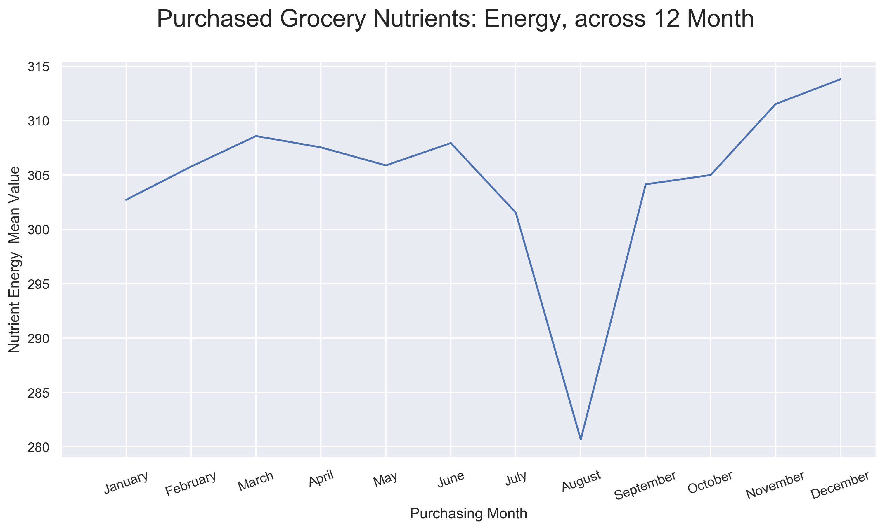
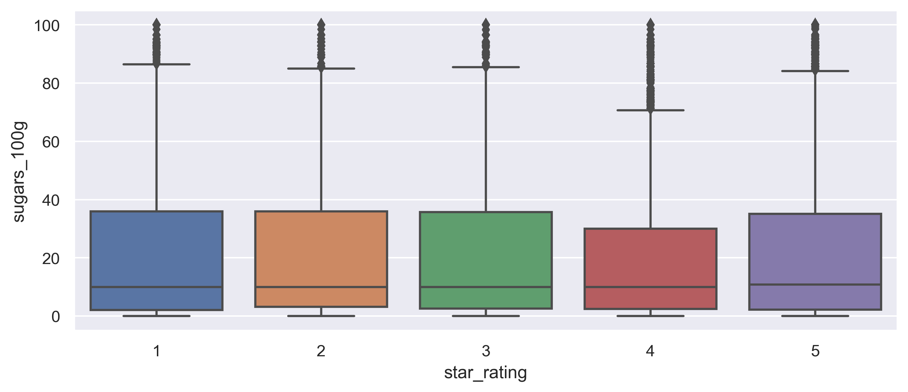
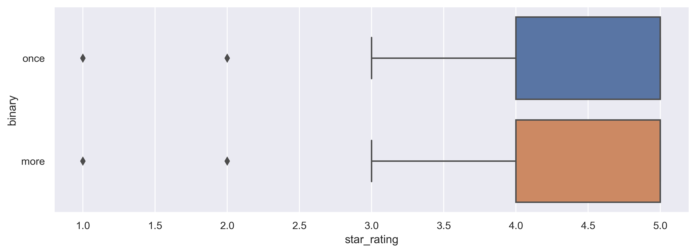
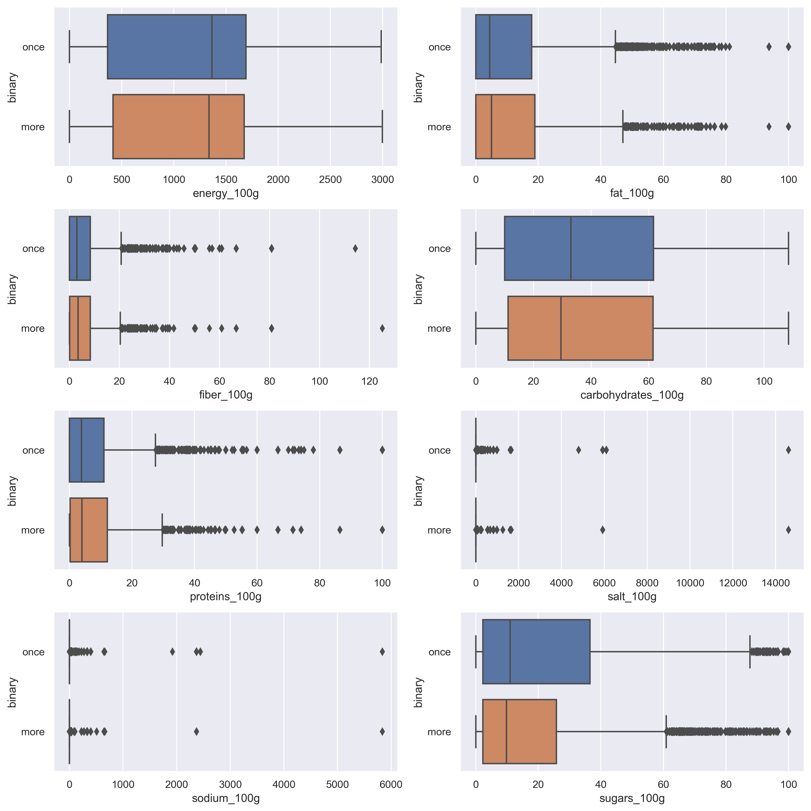
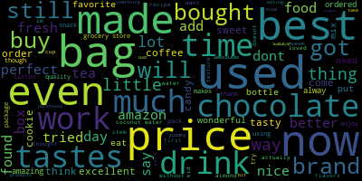
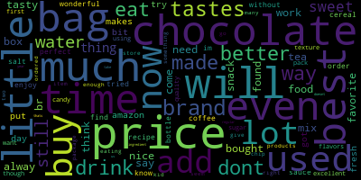

# Food Reviews

## Overview

+ With food information from Open Food Facts
+ With purchasing history and user reviews from Amazon Reviews
+ Explore the change in purchasing behavior throughout the years
+ Explore difference in user's buying behaviors

## Dataset

### Open Food Facts (OFF)

+ Summary:
  + Public dataset collected by volunteers on Food Facts
    + i.e. information on product packages
  + With 175 attributes and 950 thousand entries
+ Attributes:
  + [Full list of attributes](https://static.openfoodfacts.org/data/data-fields.txt)
+ Resources:
  + [Open Food Facts](https://world.openfoodfacts.org/)
  + [Open Food Facts data](https://world.openfoodfacts.org/data)

### Amazon Reviews: Grocery (AMZ)

+ Summary:
  + Amazon Customer Reviews, on grocery; from year 2000 to 2015
  + Including comments and ratings on each product by each customer
  + 2.4 million entries
+ Attributes:
  + [Full List of attributes](https://s3.amazonaws.com/amazon-reviews-pds/tsv/index.txt)
+ Resources:
  + [Amazon Customer Reviews Dataset](https://registry.opendata.aws/amazon-reviews/)
  + [Documentation](https://s3.amazonaws.com/amazon-reviews-pds/readme.html)
  + [Amazon Reviews, Grocery Dataset](https://s3.amazonaws.com/amazon-reviews-pds/tsv/amazon_reviews_us_Grocery_v1_00.tsv.gz)

### Merged data

+ Merge both dataset by Product Name/Title
  1. tokenize and normalize the names/titles
      + `re` to remove non-title strings and find tokens
      + tokens are sorted and lowercased
  2. remove duplications
      + OFF: same product and same size
      + OFF: same product but diff size
  3. merge food facts with each customer reviews

## Exploratory Analysis

### Explorations

1. _Do people prefer high-energy foods during colder seasons?_
    + 
    + Jan. and Feb. boxplots are slightly higher
2. _Sugar brings happiness!? Does this reflect on product rating?_
    <!-- +  -->
    + No observable difference.
3. _What are the non-verified purchases? Any special attribute of it?_
4. _Is there a group of healthy-conscious consumer?_
    + A small group of consumers only buy products with fiber around 80g
5. _Users who buys once vs. who buys multiple_
    + the majority only buys once, with 22% buys more than once
      + 
    + But ratings by the two groups doesn't show difference
      + 
    + Of all the nutrients, only sugar shows some difference  
    + **So what makes a buyer buy once vs. more??**
6. _Word difference on reviews between the two groups: buys once vs. buys multiple_
    + Word Cloud with buy once
      + 
    + Word Cloud with buy more than once
      + 

### Interactive Explorations

1. Food Explorations, i.e. by each food
    + relations beween two nutrients, interactive
      + select to compare two
2. Customer Explorations, i.e. by each customer
    + 

## Modelling

## References

+ [5 Data Science Projects](https://www.dataoptimal.com/data-science-projects-2018/)

<!-- ideas -->
<!-- using bokeh for interactive visualization -->

<!-- Data Cleaning
Exploratory Data Analysis
Interactive Data Visualizations
Machine Learning
Communication -->

<!-- instead of sentiment evaluation, evaluate if buy another product next time? -->
<!-- + Food Groups with Unsupervised learning
  + [UMAP](https://github.com/lmcinnes/umap)
+ 2nd purchasing customers, what they think and consume -->
