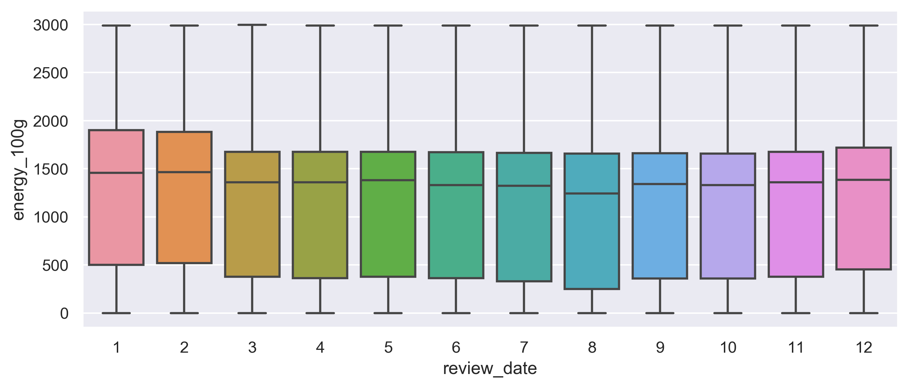

# Food Reviews

## Overview

+ With food information from Open Food Facts
+ With purchasing history and user reviews from Amazon Reviews
+ Explore the change in purchasing behavior throughout the years
+ Explore difference in user's buying behaviors

## Dataset

### Open Food Facts (OFF)

+ Summary:
  + Public dataset collected by volunteers on Food Facts
    + i.e. information on product packages
  + With 175 attributes and 950 thousand entries
+ Attributes:
  + [Full list of attributes](https://static.openfoodfacts.org/data/data-fields.txt)
+ Resources:
  + [Open Food Facts](https://world.openfoodfacts.org/)
  + [Open Food Facts data](https://world.openfoodfacts.org/data)

### Amazon Reviews: Grocery (AMZ)

+ Summary:
  + Amazon Customer Reviews, on grocery; from year 2000 to 2015
  + Including comments and ratings on each product by each customer
  + 2.4 million entries
+ Attributes:
  + [Full List of attributes](https://s3.amazonaws.com/amazon-reviews-pds/tsv/index.txt)
+ Resources:
  + [Amazon Customer Reviews Dataset](https://registry.opendata.aws/amazon-reviews/)
  + [Documentation](https://s3.amazonaws.com/amazon-reviews-pds/readme.html)
  + [Amazon Reviews, Grocery Dataset](https://s3.amazonaws.com/amazon-reviews-pds/tsv/amazon_reviews_us_Grocery_v1_00.tsv.gz)

### Merged data

+ Merge both dataset by Product Name/Title
  1. tokenize and normalize the names/titles
      + `re` to remove non-title strings and find tokens
      + tokens are sorted and lowercased
  2. remove duplications
      + OFF: same product and same size
      + OFF: same product but diff size
  3. merge food facts with each customer reviews

## Exploratory Analysis

1. Do people prefer sweeter foods during colder seasons?
    + 
2. Sugar brings happiness!? Does this reflect on product rating?
    + 
3. What are the non-verified purchases? Any special attribute of it?
4. Is there a group of healthy-conscious consumer?

+ Food Groups with Unsupervised learning
  + [UMAP](https://github.com/lmcinnes/umap)
+ 

## Modelling

+ 